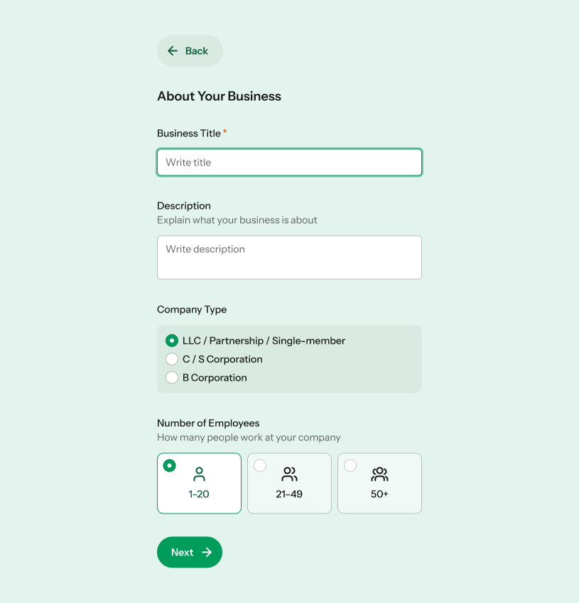

# Vaadin Create 2025 Theming Lab Example

A simple Vaadin app with a non-functional form used to demonstrate how styling is done in Vaadin 25.

Run the application with `./mvnw` from the command line, or by running the `Application.java` class from your IDE ("Debug with Hotswap").

## Design

Here's the finished design we are trying to get to ([Figma link](https://www.figma.com/design/5rMDizzp70gOpfayvc6lBA/Untitled?node-id=0-1&t=GhMYh93eDKrYg3Ey-1)):

## Resources

The proper documentation for Vaadin component base styles and the Aura theme is still under development. For now, here are a couple of resources to help out:

- [List of base style custom properties](base-style-props.md)
- [List of Aura theme custom properties](https://docs.google.com/document/d/1DfkK0X6KBWl2JONPPbWaN33RjbJjLJYBkRE-ma15wV4/edit?usp=sharing)
